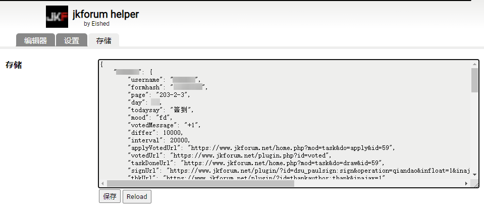

# 油猴脚本：捷克论坛助手

## 自动签到、自动感谢、自动加载原图、自动支付购买主题贴、自动完成投票任务，优化浏览体验，一键批量回帖/感谢，一键打包下载帖子图片

安装地址：`https://greasyfork.org/zh-CN/scripts/427246-jkforum-helper`

项目地址：`https://github.com/Eished/jkforum_helper`

## 已完成功能

1. 自动签到、定时签到：自定义签到参数、定时签到参数；
2. 自动完成投票任务：自定义投票参数；
3. 一键批量回帖、批量感谢：
   - 自动获取快速回帖内容；
   - 自定义回帖内容，回帖内容存储；
   - 随机内容回帖，回帖历史记录、进度存储，回帖任务管理，自动跳过已回复贴；
   - 自定义回帖基础间隔时间和随机间隔时间范围；
   - 一键添加当前页面的帖子到任务列表；
   - 输入 `版块+页码起点+页码终点`，大批量添加任务，页码存储；
4. 防止浏览器长时间运行后休眠；
5. 自动加载原图，移除图片上的下载提示；加载原图开关自定义；
6. 自动感谢`感谢可见`的贴，自动感谢浏览过的贴；自动感谢开关自定义；
7. 自动支付购买主题`购买可见`的贴；自动支付开关自定义；
8. 图片模式下，移除标题高亮；已阅的帖子，标题变成灰色，防止重复点击。
9. 版本更新时保留用户历史数据。

## 使用说明

- 登陆后脚本开始运行。
  
- 【定时签到】按钮：
  
  - 在[签到页面](https://www.jkforum.net/plugin/?id=dsu_paulsign:sign)找到【定时签到】按钮；
  - 在**零点前提前运行定时签到**，在控制台查看进度。
  
- 【**添加本页**】按钮：
  - 在 `https://www.jkforum.net/forum-` URL 开头的**版块页面**激活 ；

  - 功能为添加本页列表所有帖子到任务列表；

  - 帖子重复添加检测，提示重复时需换下一页；

  - 可输入批量回帖内容，可粘贴带有格式的文本，空则使用内置随机回复；输入多条内容时使用**中文分号**分隔 `；`，将每次随机选择一条用于回帖；

  - 回帖内容获取顺序：

    1.用户当前输入内容；

    2.内置快速回复（空则默认）；

    3.历史自定义输入过的内容（弹窗提示）；

  - **注意**：内置的获取快速回复，需要用户在可快速回复的板块有足够的浏览权限，否则不可用，请手动输入回复。

- 【**添加任务**】按钮：
   - 在首页激活；
   - 功能为添加指定范围所有帖子到任务列表；
   - 输入功能和【**添加本页**】按钮相同。
   - 在【版块-1-2】输入框 输入，格式：**`版块代码-起点页-终点页`** ；例如：`640-1-2` ；版块代码见版块URL中间数字：`forum-640-1`
   - 可任意添加不同版块帖子，按添加顺序执行。
   
- 【**回帖**】按钮 、【**感谢**】按钮：

   - 在首页激活；
   - 回复\感谢 任务列表里所有帖子。
   - 进度记忆，刷新页面可以继续上次 回帖\感谢。
   - 详细运行进度在控制台查看。

- **参数自定义**：

  - 先打开网页运行一次，就可以在脚本看到存储页面：

    

  - 可自定义的值：

    ```javascript
            "username": "",
            "formhash": "",
            "version": "0.3.8",
            "today": "",
            "signtime": "23:59:59", // 定时签到时间
            "signNum": 10, // 定时签到重试次数
            "interTime": 200, // 定时签到重试间隔时间
            "todaysay": "簽到", // 签到输入内容
            "mood": "fd", // 签到心情
            "differ": 10000, // 回帖随机间隔时间
            "interval": 20000, // 回帖基础间隔时间
            "autoPaySw": 1, // 自动支付开关
            "autoThkSw": 1, // 自动感谢开关
            "autoRePicSw": 1, // 自动加载原图开关
            "page": "", // 批量回帖页码
            "votedMessage": "+1", // 投票输入内容
            "userReplyMessage": [], // 用户输入的回复历史记录
            "replyMessage": [], // 输入的回复缓存
            "fastReply": [], // 默认快速回复
            "replyThreads": [], // 回帖任务数据
    ```
    
  - 如果参数改错了或出现异常，删掉 `"version": "0.3.8",` 和错误的参数行，运行脚本会自动初始化缺失的参数。

**注意：保持脚本页面前台运行，否则会导致进程休眠！建议单开一个浏览器窗口跑脚本。**

## 待完成功能

- 批量下载原图，并按`img.alt`命名
  - 普通下载：帖子页面加载完所有图片才可运行下载。
  - 快速下载：输入链接，直接获取所有下载链接。
  - 任务列表功能，用于管理回帖任务