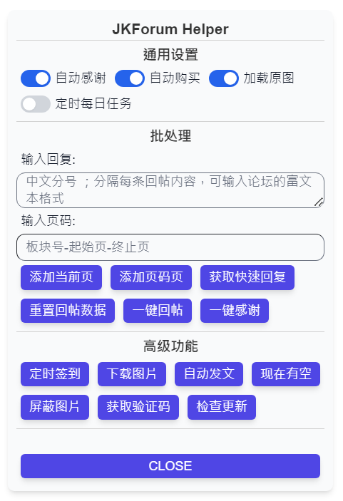

# 油猴脚本：JKF 捷克论坛助手

## 自动签到、自动感谢、自动加载原图、自动播放图片、自动支付购买主题贴、自动完成投票任务，优化浏览体验，一键批量回帖/感谢，一键打包下载帖子图片，自动识别验证码，自动'现在有空'，自动发文


安装地址：[`https://greasyfork.org/zh-CN/scripts/427246-jkforum-helper`](https://greasyfork.org/zh-CN/scripts/427246-jkforum-helper)

项目地址：[`https://github.com/Eished/jkforum_helper`](https://github.com/Eished/jkforum_helper)

参与开发：[开发文档](https://github.com/Eished/jkforum_helper/blob/main/doc)

## 使用说明：



1. 登录 JKForum 后脚本开始运行。
2. 鼠标点击任意 JKForum 页面左侧黄色 F 按钮，即可看到控制面板。
3. 仅测试油猴 **Tampermonkey + Chrome** 的兼容性。
4. 需要定制功能请私聊或[发送邮件](mailto:kished@outlook.com)。

### 通用设置

#### 自动感谢、自动购买

- 自动感谢、购买当前访问的包含隐藏内容的帖子

#### 加载原图

- 自动将当前访问的包含图片的帖子的图片切换为原图。建议保持开启加载原图，提高图片加载速度，解决网站反向压缩问题（画质降低，体积增大）。

#### 自动播放

- 在帖子页面浏览大图时激活，图片右上角黄色长方形播放按钮；
- 可设置播放间隔时间；
- 离开页面自动暂停播放。


#### 定时每日任务

- 在不刷新网页的情况下，自动定时检测是否需要执行每日任务

### 批处理

#### 添加当前页

- 在 `https://www.jkforum.net/forum-` URL 开头的版块页面激活；
- 功能为添加本页列表所有帖子到任务列表；
- 帖子重复添加检测，自动跳过重复贴。
- 在【输入回复：】输入批量回帖内容，可粘贴带有格式的文本，空则使用内置随机回复，输入多条内容时使用**中文分号**分隔 `；`，将每次随机选择一条用于回帖。

回帖内容获取顺序：

1. 用户当前输入内容；

2. 内置快速回复（前者为空时，弹窗提示使用）；

3. 历史自定义输入过的内容（没有获取到前两者时，弹窗提示使用）；

#### 添加页码页

- 功能为添加指定范围所有帖子到任务列表，其它功能和【**添加当前页**】按钮相同。
- 在【输入页码：】 输入，格式：**`版块代码-起点页-终点页`** ；例如：`640-1-2` ；版块代码见版块 URL 中间数字：`forum-555-1`。
- 可任意添加不同版块帖子，按添加顺序执行。

#### 获取快速回复

- 手动获取快速回复，需要用户有浏览权限（見習騎士），否则需手动输入回复。
- 每次版本更新后自动重新获取。

#### 重置回帖数据

- 清空回帖任务、用户历史回复、快速回复数据

#### 一键回帖、一键感谢

- 顺序回复、感谢任务列表里所有帖子。
- 进度记忆，刷新页面可以继续上次回帖、感谢。
- 两个按钮可以同时使用。详细运行进度在控制台查看。

**注：**大批量回复仅建议在 報到專區 内完成 **迎新大使任務則需要回覆新人 1000 次** 时使用，其它用途可能违反版规。

### 高级功能

#### 定时签到

- 在零点前提前运行定时签到，在控制台查看进度。

#### 下载图片

- 在帖子页面激活；功能为打包下载本页所有图片。
- 自动检测文件名是否正确，以及文件缺失提示。
- 顺序依次下载，文件夹按 `[帖子标题+图片数量]` 命名，图片按 `[图片标题+序号]` 命名。
- 图片不显示、下载返回 404 时，尝试以下操作：
  1. 更换代理节点。
  2. 在路由器上屏蔽或代理 quic 协议流量。
  3. 路由器代理软件未能代理 quic 流量会导致 404，需要开启路由器服务端代理，使用浏览器插件或系统代理连接至路由器代理可以解决。
  4. 在浏览器关闭 quic 协议：chrome 浏览器关闭 quic
     1. 在谷歌浏览器输入框中输入： `chrome://flags/#enable-quic`
     2. `Experimental QUIC protocol`设置为`Disabled`

#### 屏蔽图片

- 在帖子页面激活；屏蔽帖子所有图片，终止图片加载，提高下载速度。

#### 现在有空

- 自动我有空，自动点击现在有空按钮。
- 需要验证令牌，令牌免费试用，[获取令牌](https://jkf.iknow.fun/)。
- 默认每 55 分钟点击一次，可自定义间隔，和自定义运行时间段。
- 支持一个账号的多个帖子。
- 支持多账号登录，[用 Chrome 同时登录多个账号](https://iknow.fun/2023/06/23/chrome-tong-shi-deng-lu-duo-ge-zhang-hao-wang-zhan-duo-kai-jiao-cheng/)。


#### 获取验证码

- 服务器托管登录账号时使用，通过谷歌验证后，复制验证码到托管网站登录页中进行登录。

#### 自动发文

- 在版块发表文章页面激活，输入好文章后启动自动发文，脚本会保存当前文章并按设定时间重复发文；

- 支持任意板块自动发文，支持设置间隔时间

## TODO：

### 202105：

- [x] **自动签到、定时签到、自动完成投票任务**：可自定义参数；
- [x] **浏览优化**：
  - [x] 自动加载原图，移除图片上的下载提示；
  - [x] 自动感谢所有浏览的贴；
  - [x] 自动支付购买主题 `购买可见` 的贴；
  - [x] 移除标题高亮，已阅帖子标题变灰色。
  - [x] 自动播放图片。
- [x] **一键批量回帖、批量感谢**：
  - [x] 自动获取快速回复；可输入回复，输入回复存储；
  - [x] 随机回复回帖、回帖进度存储、回帖任务管理；回帖间隔时间范围可自定义；
  - [x] 一键添加当前版块帖子到任务列表；输入 `版块-页码起点-页码终点`，批量添加任务；
  - [x] 自动启动防止浏览器降频休眠功能。
  - [x] 版本更新保留用户数据。
- [x] **一键打包下载帖子图片**：
  - [x] 屏蔽图片功能。
  - [x] 图片并发下载，可设置并发数，默认 2。
- [x] **油猴菜单栏**：
  - [x] 可关闭不需要的功能。
  - [x] 自动识别验证码，保持现在有空

### 202204：

- [x] 管理面板：
  - [x] 使用 React + TypeScript + Tailwindcss 重构，增加管理面板。
  - [x] 可清空已完成任务数据；
  - [x] 整合所有按钮、输入框和参数设置；
  - [x] 增加按下后禁用，防止重复点击；
- [x] 分模块打包，减小发布大小
- [x] Github Actions 自动构建发布
- [ ] ~~集中状态管理 useContext or Redux~~
- [ ] ~~代码分为模块与插件动态加载，形成通用型油猴脚本开发平台~~

### 202210：

- [x] 跳过登录时强制验证手机号界面
- [ ] 增加导航菜单界面
- [ ] 按钮加上提示信息
- [ ] 拆分细化批量添加输入框
- [x] 重构自动现在有空：增加多用户、多帖子管理界面
  - [x] 增加 api key 验证方式
  - [x] 增加 api 调用统计页面
  - [x] 单用户自动点击多个帖子，自动查找、记录用户的多个贴，用户选择自动点击哪个贴
  - [ ] 多用户同时自动点击，一键切换账号功能

### 202302

- [x] 重构自动现在有空：修改定时机制，修改并发机制，增加停止运行按钮
  - [x] 增加重试次数超过 10 次就停止运行，并提示检查帖子状态

### 202307

- [x] 自动现在有空：增加在固定时间段执行功能
  - [x] 表格自适应展示数量
  - [x] 增加运行状态展示
  - [x] 图片预处理，提高传输效率
- [x] 增加后台检查并执行每日任务（签到、投票等）
  - [x] 定时检查每日任务开关

### 202312

- [x] 移除深色模式
- [x] 增加任意板块自动发文，支持设置间隔时间

### 20240120

- [x] 自动现在有空：服务器错误时，不退出程序，重试后保持运行

### 20250709

- [x] 自动现在有空：
  - [x] 休眠状态唤醒时重复调用时间检测误差增加到10分钟，错过点击时间时改为重置点击时间到下一个点击周期
  - [x] 不在运行时间内时，启动时间随机数增加到120秒内，减少并发启动时造成的错误重试
- [x] 移除登录时跳过手机验证码功能

## 参数自定义

- 进入 Tampermonkey 设置，`通用` 第一项 `配置模式` 改成 `高级`；

- 打开网页运行一次，就可以在脚本看到存储页面：

  

- 可自定义的值：

  ```javascript
  {
    version: '',
    today: '', // 签到日期
    signtime: '23:59:59', // 定时签到时间
    signNum: 10, // 定时签到重试次数
    interTime: 200, // 定时签到重试间隔时间ms
    todaysay: '簽到', // 签到输入内容
    mood: 'fd', // 签到心情
    autoPlayDiff: 2000, // 自动播放图片间隔时间ms
    autoPaySw: true, // 自动支付开关
    autoThkSw: true, // 自动感谢开关
    autoRePicSw: true, // 自动加载原图开关
    differ: 10000, // 回帖随机间隔时间范围ms
    interval: 20000, // 回帖基础间隔时间ms
    thkDiffer: 1000, // 批量感谢间隔时间ms
    limit: 2, // 并发下载图片数量限制
    page: '', // 批量回帖页码
    token: '', // OCR token
    freeTime: 3600000, // 现在有空间隔
    freeTid: '', // 自动现在有空 帖子ID，一个账号一个贴子
    votedMessage: '+1', // 投票输入内容
    userReplyMessage: [], // 用户保存的回复，历史回帖内容
    fastReply: [], // 保存的快速回复，快速回帖内容
    replyThreads: [], // 回帖任务数据，管理回帖任务
  }
  ```

- 如果参数改错了或出现异常，删掉 `"version": "x.x.x",` 右边双引号内的内容和错误参数右边双引号内的内容（或整行），运行脚本会自动初始化缺失的参数。

**注意：因为使用了 TailwindCSS 可能会有部分样式冲突，留言反馈。**

## 赞助作者

[https://www.patreon.com/kished](https://www.patreon.com/kished)
